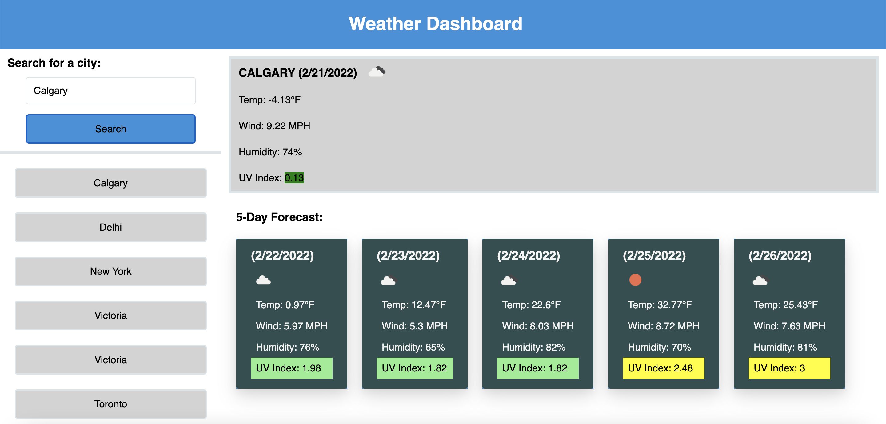

# Weather Dashboard
* As a traveler, you can use this application to see the weather outlook for multiple cities and plan a trip accordingly
### Walk Through
* Enter any valid city name in the search bar and hit search button
* You will be presented with the city name, the date, an icon representation of weather conditions, the temperature, the humidity, the wind speed, and the UV index
* You will also be presented with 5 Days weather forecast
* Search history is available in the left navigation, and on click you will again be presented with current and future conditions for that city

